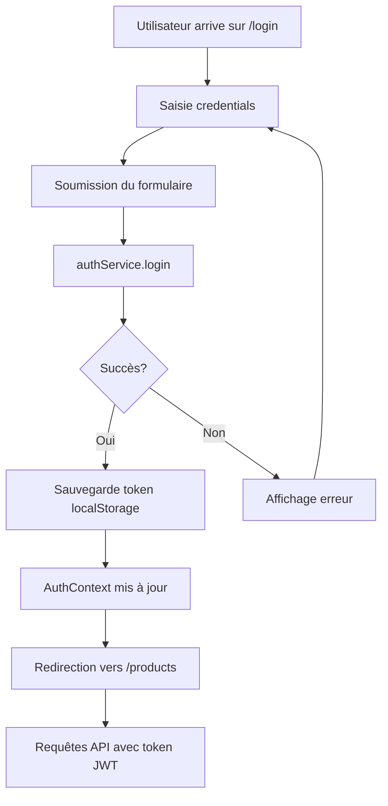

# 🛒 **E-Market – Frontend React**

## 📋 **Vue d'ensemble**

E-Market Frontend est une application e-commerce moderne développée avec **React 18 + Vite**. Elle offre une interface utilisateur intuitive et responsive pour la gestion complète d'un compte utilisateur, la navigation des produits et le suivi des commandes.

---

## ⚙️ **Technologies utilisées**

| Catégorie            | Outil                                      |
| -------------------- | ------------------------------------------ |
| **Framework**        | React 18 + Vite                            |
| **Styling**          | TailwindCSS                                |
| **Routing**          | React Router DOM v6                        |
| **State Management** | Context API (AuthContext)                  |
| **HTTP Client**      | Axios                                      |
| **Authentification** | JWT (stockage localStorage)                |
| **Icons**            | React Icons (AI icons)                     |
| **Build Tool**       | Vite                                       |
| **Linting**          | ESLint                                     |

---

## 📁 **Structure du projet**

```
Front-End/
├── public/                      # Fichiers statiques
├── src/
│   ├── assets/
│   │   └── images/             # Images et ressources
│   │
│   ├── components/
│   │   ├── common/             # Composants réutilisables
│   │   │   ├── Alert.jsx       # Messages de feedback
│   │   │   ├── Avatar.jsx      # Photo de profil
│   │   │   ├── Badge.jsx       # Badges de statut
│   │   │   ├── Button.jsx      # Boutons avec états
│   │   │   ├── Card.jsx        # Cartes produits/info
│   │   │   ├── Input.jsx       # Champs de saisie
│   │   │   ├── PasswordInput.jsx  # Champ mot de passe
│   │   │   ├── LoadingSpinner.jsx # Indicateurs de chargement
│   │   │   └── Tabs.jsx        # Navigation par onglets
│   │   │
│   │   └── layout/             # Composants de mise en page
│   │       ├── Header.jsx      # Navigation principale
│   │       └── Footer.jsx      # Pied de page
│   │
│   ├── context/
│   │   └── AuthContext.jsx     # Gestion globale de l'authentification
│   │
│   ├── hooks/
│   │   ├── useAuth.js          # Hook d'authentification
│   │   └── useFetch.js         # Hook pour les appels API
│   │
│   ├── pages/
│   │   ├── Home.jsx            # Page d'accueil
│   │   ├── Login.jsx           # Page de connexion
│   │   ├── Register.jsx        # Page d'inscription
│   │   ├── Logout.jsx          # Page de déconnexion
│   │   ├── Profile.jsx         # Profil utilisateur complet
│   │   ├── ProductDetails.jsx  # Détails d'un produit
│   │   └── NotFound.jsx        # Page 404
│   │
│   ├── routes/                 # Configuration des routes
│   │
│   ├── services/
│   │   └── api.js              # Configuration Axios
│   │
│   ├── App.jsx                 # Composant principal
│   ├── App.css                 # Styles globaux
│   ├── main.jsx                # Point d'entrée
│   └── index.css               # Styles Tailwind
│
├── index.html
├── package.json
├── vite.config.js
├── eslint.config.js
└── README.md
```

---

## ✅ **Fonctionnalités implémentées**

### 🔐 **Authentification complète**

- ✅ **Page de connexion** ([`Login.jsx`](src/pages/Login.jsx))
  - Formulaire avec validation en temps réel
  - Messages d'erreur contextuels
  - Redirection automatique après connexion
  
- ✅ **Page d'inscription** ([`Register.jsx`](src/pages/Register.jsx))
  - Validation des champs (email, mot de passe, confirmation)
  - Sélection du rôle (Acheteur/Vendeur)
  - Feedback visuel immédiat
  
- ✅ **Déconnexion sécurisée** ([`Logout.jsx`](src/pages/Logout.jsx))
  - Nettoyage du localStorage
  - Redirection vers la page de connexion
  
- ✅ **Gestion des sessions** via [`AuthContext`](src/context/AuthContext.jsx)
  - État global de l'utilisateur
  - Persistance de la session
  - Vérification automatique du token
  - Protection des routes privées

### 👤 **Profil utilisateur avancé**

La page [`Profile.jsx`](src/pages/Profile.jsx) offre une interface complète avec **navigation par onglets** :

#### 📊 **Onglet Informations personnelles**
- ✅ Affichage et modification du nom complet
- ✅ Modification de l'email
- ✅ Upload d'avatar avec prévisualisation
- ✅ Affichage du rôle utilisateur (badge coloré)
- ✅ Sauvegarde des modifications avec feedback

#### 🔒 **Onglet Sécurité**
- ✅ Changement de mot de passe
- ✅ Validation de l'ancien mot de passe
- ✅ Vérification de la correspondance (nouveau/confirmation)
- ✅ Affichage/masquage du mot de passe
- ✅ Messages de succès/erreur

#### 📦 **Onglet Mes commandes**
- ✅ Liste complète des commandes passées
- ✅ Badges de statut colorés :
  - 🟡 En attente (jaune)
  - 🔵 En cours (bleu)
  - 🟣 Expédié (violet)
  - 🟢 Livré (vert)
  - 🔴 Annulé (rouge)
- ✅ Détails des commandes (articles, quantités, prix)
- ✅ Calcul du total par commande
- ✅ Date de commande formatée
- ✅ État vide géré ("Aucune commande")

### 🏠 **Navigation et pages**

| Page                    | Route             | Description                              |
| ----------------------- | ----------------- | ---------------------------------------- |
| **Home**                | `/`               | Page d'accueil avec liste des produits   |
| **Login**               | `/login`          | Formulaire de connexion                  |
| **Register**            | `/register`       | Formulaire d'inscription                 |
| **Profile**             | `/profile`        | Profil utilisateur avec onglets          |
| **Product Details**     | `/products/:id`   | Détails d'un produit                     |
| **Logout**              | `/logout`         | Page de déconnexion                      |
| **404 Not Found**       | `*`               | Page d'erreur pour routes inexistantes   |

### 🧩 **Composants réutilisables**

#### **Alert** (`components/common/Alert.jsx`)
- Messages de succès/erreur/warning
- Auto-fermeture optionnelle
- Variantes colorées (success, error, warning, info)

#### **Avatar** (`components/common/Avatar.jsx`)
- Affichage de la photo de profil
- Fallback avec initiales si pas d'image
- Tailles configurables (sm, md, lg)

#### **Badge** (`components/common/Badge.jsx`)
- Badges colorés pour les statuts
- Variantes : primary, secondary, success, danger, warning, info
- Utilisé pour les rôles et statuts de commandes

#### **Button** (`components/common/Button.jsx`)
- Boutons avec états de chargement
- Variantes : primary, secondary, danger, outline
- Tailles : sm, md, lg
- Support des icônes

#### **Card** (`components/common/Card.jsx`)
- Cartes avec effets hover
- Utilisées pour les produits et sections
- Responsive

#### **Input** (`components/common/Input.jsx`)
- Champs de saisie avec label
- Validation en temps réel
- Messages d'erreur intégrés
- Support des types variés (text, email, number, etc.)

#### **PasswordInput** (`components/common/PasswordInput.jsx`)
- Champ spécifique pour les mots de passe
- Toggle affichage/masquage
- Validation intégrée
- Indicateur de force (optionnel)

#### **LoadingSpinner** (`components/common/LoadingSpinner.jsx`)
- Indicateurs de chargement
- Utilisés pendant les requêtes API
- Variantes : spinner, dots, pulse

#### **Tabs** (`components/common/Tabs.jsx`)
- Navigation par onglets
- Active tab avec style distinct
- Responsive

### 🪝 **Custom Hooks**

#### **useAuth** (`hooks/useAuth.js`)
```javascript
const { user, isAuthenticated, login, logout, updateUser } = useAuth();
```
- Accès simplifié au contexte d'authentification
- Méthodes pour login/logout
- État utilisateur et authentification

#### **useFetch** (`hooks/useFetch.js`)
```javascript
const { data, loading, error } = useFetch('/api/endpoint');
```
- Gestion simplifiée des appels API
- États de chargement et erreurs
- Rechargement automatique

---

## 🔗 **Services API**

### **Configuration principale** (`services/api.js`)

```javascript
import axios from 'axios';

const api = axios.create({
  baseURL: 'http://localhost:3000/api',
  headers: { 
    'Content-Type': 'application/json' 
  }
});

// Intercepteur pour ajouter le token JWT automatiquement
api.interceptors.request.use((config) => {
  const token = localStorage.getItem('token');
  if (token) {
    config.headers.Authorization = `Bearer ${token}`;
  }
  return config;
});

// Gestion des erreurs globales
api.interceptors.response.use(
  (response) => response,
  (error) => {
    if (error.response?.status === 401) {
      // Déconnexion automatique si token invalide
      localStorage.removeItem('token');
      window.location.href = '/login';
    }
    return Promise.reject(error);
  }
);

export default api;
```

### **Endpoints utilisés**

```javascript
// Authentification
POST   /api/auth/login          // Connexion
POST   /api/auth/register       // Inscription
POST   /api/auth/logout         // Déconnexion

// Utilisateur
GET    /api/users/profile       // Récupérer le profil
PUT    /api/users/profile       // Modifier le profil
PUT    /api/users/profile/password  // Changer le mot de passe

// Produits
GET    /api/products            // Liste des produits
GET    /api/products/:id        // Détails d'un produit

// Commandes
GET    /api/orders              // Liste des commandes de l'utilisateur
GET    /api/orders/:id          // Détails d'une commande
```

---

## 🎨 **Design & UX**

### **Palette de couleurs**

- **Primary** : Bleu (#3B82F6)
- **Secondary** : Violet (#8B5CF6)
- **Success** : Vert (#10B981)
- **Danger** : Rouge (#EF4444)
- **Warning** : Jaune (#F59E0B)
- **Info** : Cyan (#06B6D4)

### **Principes UX**

- ✅ Design **mobile-first** et entièrement responsive
- ✅ Animations et transitions fluides (Tailwind transitions)
- ✅ États de chargement pour toutes les actions asynchrones
- ✅ Messages de feedback utilisateur clairs (Alert)
- ✅ Validation en temps réel des formulaires
- ✅ Navigation intuitive avec breadcrumbs
- ✅ Accessibilité (labels, aria-labels, contraste)

### **Composants visuels**

- Cards avec effets hover et shadow
- Badges colorés pour les statuts
- Boutons avec états disabled et loading
- Formulaires avec validation visuelle
- Navigation par onglets claire
- Avatar avec fallback élégant

---

## 🚀 **Installation & Lancement**

### **Prérequis**

- Node.js v16+
- npm ou yarn

### **Installation**

```powershell
# 1️⃣ Naviguer dans le dossier Frontend
cd Front-End

# 2️⃣ Installer les dépendances
npm install
```

### **Configuration**

Créer un fichier `.env` à la racine de `Front-End/` :

```env
VITE_API_URL=http://localhost:3000/api
```

### **Commandes disponibles**

```powershell
# Lancer le serveur de développement
npm run dev

# Build pour la production
npm run build

# Prévisualiser le build de production
npm run preview

# Linter le code
npm run lint
```

Le projet démarre sur : 👉 **[http://localhost:5173](http://localhost:5173)**

---

## 🔄 **Flux d'authentification**



---

## 📊 **État actuel du projet**

| Module                              | État | Description                               |
| ----------------------------------- | ---- | ----------------------------------------- |
| ⚙️ Configuration React + Vite        | ✅    | Projet initialisé avec Vite              |
| 🎨 TailwindCSS                      | ✅    | Configuration complète                    |
| 🧭 React Router DOM                 | ✅    | Navigation avec routes protégées          |
| 🔐 Authentification JWT             | ✅    | Login, Register, Logout fonctionnels      |
| 👤 Profil utilisateur               | ✅    | Modification infos, mot de passe, avatar  |
| 📦 Commandes utilisateur            | ✅    | Affichage historique avec statuts         |
| 🧩 Composants UI                    | ✅    | 9+ composants réutilisables               |
| 🪝 Custom Hooks                     | ✅    | useAuth, useFetch                         |
| 🔗 Services API                     | ✅    | Axios configuré avec intercepteurs        |
| 📱 Responsive Design                | ✅    | Mobile, Tablet, Desktop                   |
| ♿ Accessibilité                    | ✅    | Labels, ARIA, contraste                   |
| 🎭 Animations                       | ✅    | Transitions Tailwind                      |

---

## 🚧 **Prochaines fonctionnalités (Frontend)**

- [ ] **Panier d'achat**
  - Ajout/suppression de produits
  - Mise à jour des quantités
  - Calcul du total en temps réel
  
- [ ] **Page Produits avancée**
  - Filtres par catégorie, prix, note
  - Recherche en temps réel
  - Pagination/scroll infini
  
- [ ] **Système de favoris/Wishlist**
  - Ajout aux favoris
  - Page dédiée
  
- [ ] **Notifications en temps réel**
  - WebSocket pour les notifications
  - Centre de notifications
  
- [ ] **Reviews & Ratings**
  - Ajouter un avis sur un produit
  - Système de notation (étoiles)
  
- [ ] **Dashboard vendeur** (si rôle = vendeur)
  - Gestion des produits
  - Statistiques de ventes
  
- [ ] **Tests**
  - Tests unitaires (Vitest)
  - Tests d'intégration (React Testing Library)
  - Tests E2E (Cypress)

---

## 📦 **Dépendances principales**

```json
{
  "dependencies": {
    "react": "^18.2.0",
    "react-dom": "^18.2.0",
    "react-router-dom": "^6.20.0",
    "axios": "^1.6.0",
    "react-icons": "^4.12.0"
  },
  "devDependencies": {
    "@vitejs/plugin-react": "^4.2.0",
    "vite": "^5.0.0",
    "tailwindcss": "^3.3.0",
    "autoprefixer": "^10.4.16",
    "postcss": "^8.4.32",
    "eslint": "^8.55.0"
  }
}
```

---

## 🎓 **Concepts React utilisés**

- ✅ **Hooks** : useState, useEffect, useContext, useNavigate
- ✅ **Context API** : Gestion globale de l'état (AuthContext)
- ✅ **Custom Hooks** : Logique réutilisable (useAuth, useFetch)
- ✅ **Props & Composition** : Composants modulaires
- ✅ **Conditional Rendering** : Affichage conditionnel
- ✅ **Lists & Keys** : Rendu de listes optimisé
- ✅ **Forms** : Gestion d'événements et validation
- ✅ **Protected Routes** : Routes nécessitant authentification

---

## 📝 **Bonnes pratiques appliquées**

- ✅ Structure de dossiers claire et organisée
- ✅ Composants réutilisables et modulaires
- ✅ Séparation des responsabilités (UI / Logique / Services)
- ✅ Gestion centralisée de l'état d'authentification
- ✅ Validation côté client pour UX améliorée
- ✅ Messages d'erreur clairs et contextuels
- ✅ Code propre et commenté
- ✅ Nommage cohérent (PascalCase pour composants)
- ✅ Gestion des états de chargement et d'erreur
- ✅ Responsive design systématique

---

## 📞 **Support**

Pour toute question concernant le frontend :
- Consulter les composants dans `src/components/`
- Vérifier la configuration dans `vite.config.js`
- Examiner les services API dans `src/services/api.js`
